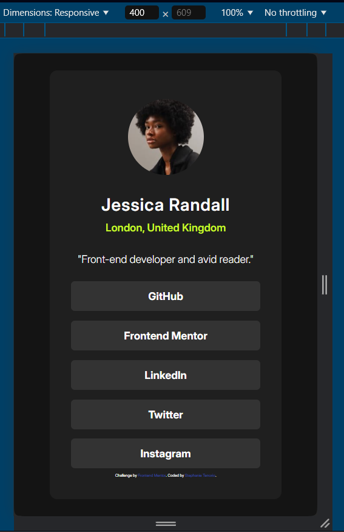
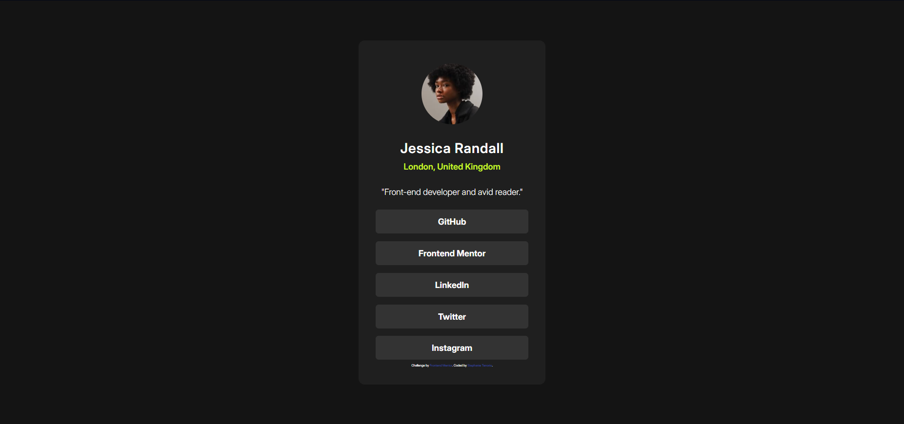

# Social Profile Links solution under the Mobile-First approach using HTML5 and CSS3

This is a solution to the [Social links profile challenge on Frontend Mentor](https://www.frontendmentor.io/challenges/social-links-profile-UG32l9m6dQ). Frontend Mentor challenges help you improve your coding skills by building realistic projects. 

## Table of contents

- [Overview](#overview)
  - [The challenge](#the-challenge)
  - [Screenshot](#screenshot)
  - [Links](#links)
- [My process](#my-process)
  - [Built with](#built-with)
  - [What I learned](#what-i-learned)
  - [Continued development](#continued-development)
  - [Useful resources](#useful-resources)
- [Author](#author)

## Overview

### The challenge

Users should be able to:

- See hover and focus states for all interactive elements on the page

### Screenshot




### Links

- Solution URL: [My repositery](https://github.com/NuppyDev/SocialLinkProfile.git)
- Live Site URL: [Netlify](https://your-live-site-url.com)

## My process

### Built with

- Semantic HTML5 markup
- CSS custom properties
- Flexbox
- Mobile-first workflow styles


### What I learned

More than anything, what I had to reinforce when doing this practice is the use of the FLEXBOX

```css
body{
    background-color: var(--Color-Grey-900);
    color: var(--Color-White);
    height: 100vh;
    justify-content: center;
}
```

### Continued development

The areas that I may possibly focus on are styling, because I feel that I could improve more in that area.


### Useful resources

- [Desafío HTML + CSS — Parte 1: Mobile First](https://youtu.be/ERnGV1zvOJ0?si=dYnBxDv1IIMTGxib) - This helped me for the reason of how to start with development under Mobile-First. I really liked this pattern and will use it in the future.


## Author

- Frontend Mentor - [@NuppyDev](https://www.frontendmentor.io/profile/NuppyDev)